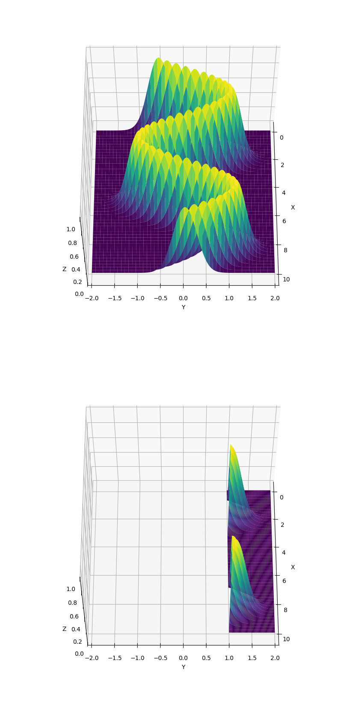

La funzione `compute_out_of_bounds_probability` calcola la probabilità che il valore \( y \) sia al di fuori di un certo limite inferiore specificato, basandosi su una tendenza (o trend) fornita.

Ecco una descrizione dettagliata della funzione:

1. **Parametri**:
    - `deserialized_trend`: Una funzione che rappresenta la tendenza de-serializzata. Questa funzione accetta un valore \( x \) e restituisce il valore corrispondente \( y \) sulla tendenza.
    - `std`: La deviazione standard del processo, che influisce sui limiti di \( y \).
    - `x_lower_limit`, `x_upper_limit`: Limiti inferiori e superiori di \( x \), che definiscono l'intervallo in cui calcolare la probabilità.
    - `y_lower_bound`: Limite inferiore di \( y \), rispetto al quale viene calcolata la probabilità.

2. **Generazione dei Valori di \( x \)**:
   La funzione genera valori \( x \) distribuiti uniformemente nell'intervallo specificato tra `x_lower_limit` e `x_upper_limit`.

3. **Calcolo dei Valori di Tendenza**:
   La tendenza viene calcolata utilizzando la funzione della tendenza de-serializzata per ogni valore \( x \) generato.

4. **Determinazione dei Limiti di \( y \)**:
   I limiti superiori e inferiori di \( y \) vengono impostati aggiungendo e sottraendo **\( 4*std \)** rispettivamente ai valori massimi e minimi della tendenza calcolati.

5. **Generazione della Funzione Superficiale**:
   Viene generata una funzione superficiale utilizzando la funzione della tendenza de-serializzata e la deviazione standard.

6. **Calcolo della Probabilità**:
   Utilizzando la funzione superficiale generata, vengono eseguite integrazioni doppie per calcolare il volume del segmento (ovvero la regione in cui \( y \) è inferiore al limite specificato) e il volume totale (regione in cui \( y \) cade all'interno dei limiti superiori e inferiori). La probabilità viene quindi calcolata come la frazione del volume del segmento rispetto al volume totale, moltiplicata per \( 100 \) per ottenere la percentuale.

7. **Ritorno**:
   La funzione restituisce la probabilità calcolata, la funzione superficiale generata, i limiti inferiore e superiore di \( y \).

In breve, la funzione `compute_out_of_bounds_probability` fornisce una stima della probabilità che i valori di \( y \) siano al di fuori di un certo limite inferiore, basandosi sulla tendenza dei dati e sulla deviazione standard del processo.