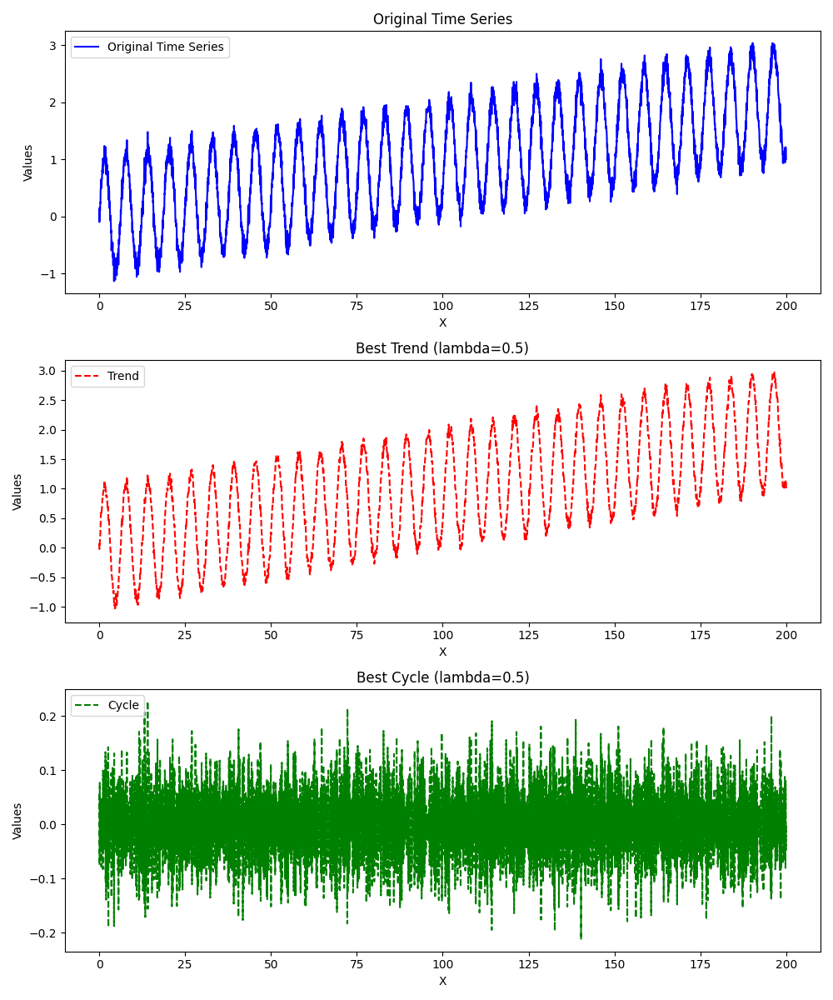
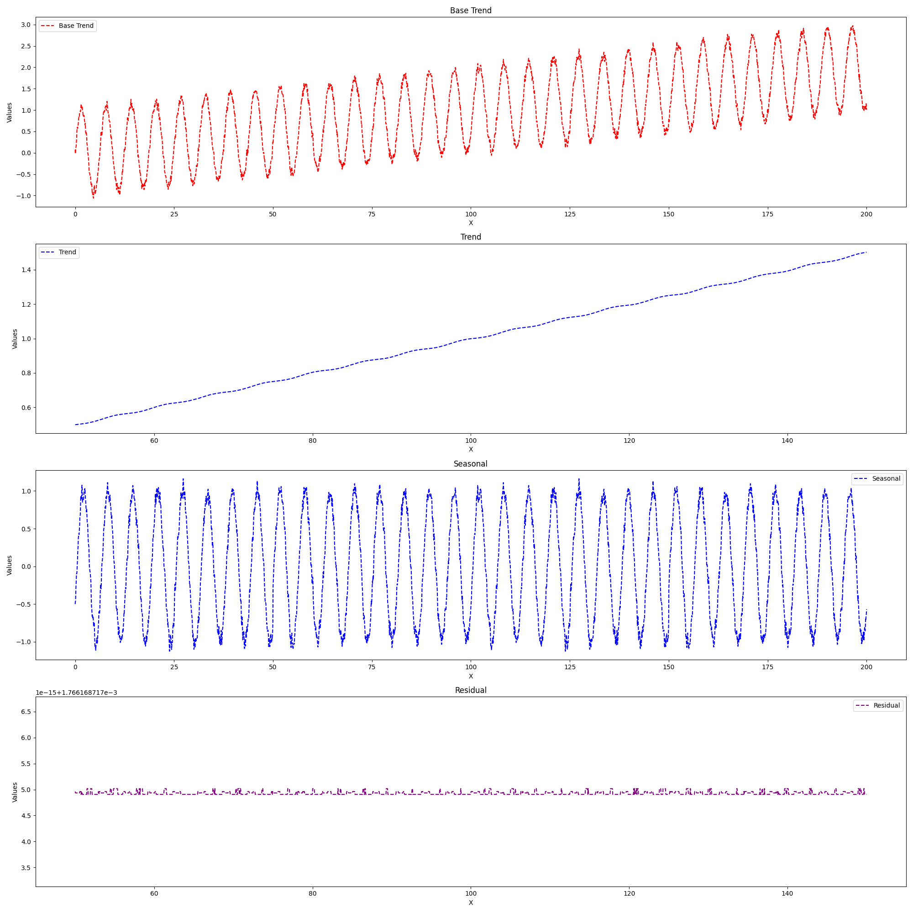
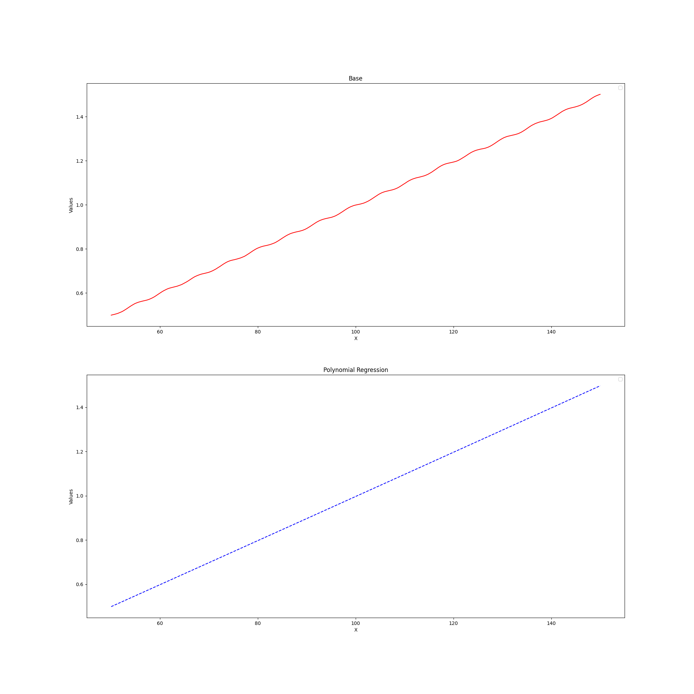
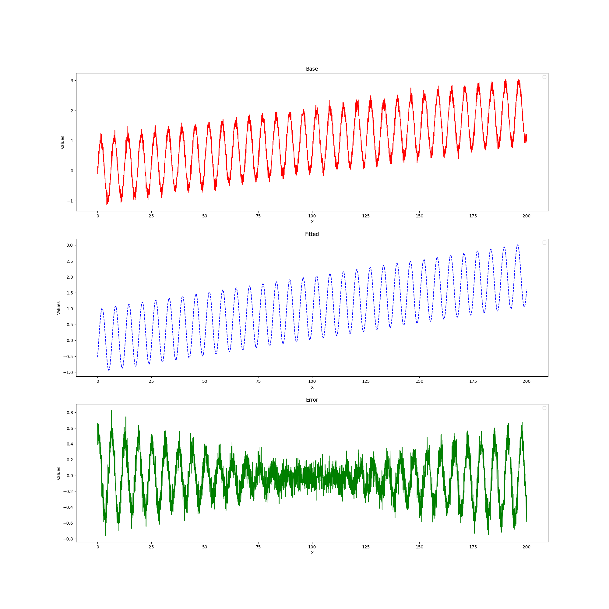
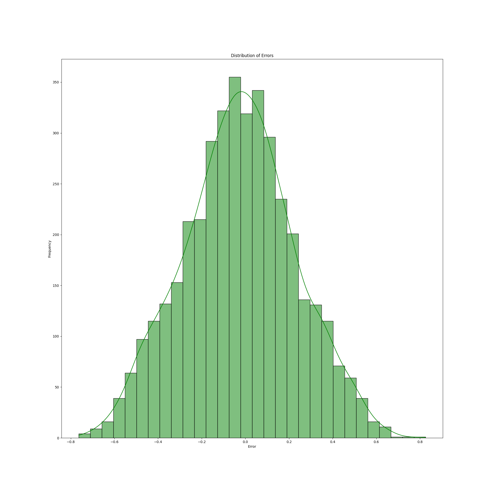

La funzione `reevaluate_model` è progettata per ri-valutare un modello utilizzando i dati forniti come input. Ecco una descrizione completa di cosa fa questa funzione:

1. **Formato dei dati**: La funzione inizia convertendo i dati forniti in una struttura più gestibile. Prende una lista di tuple contenenti timestamp e i valori corrispondenti e li converte in un DataFrame di pandas con colonne per il timestamp e i valori.

2. **Filtro di Hodrick-Prescott (HP)**: Applica il filtro di Hodrick-Prescott (HP) per scomporre la serie temporale in una componente ciclica (cycle) e una componente di trend (trend). Utilizza una gamma di valori lambda predefinita e cerca il valore di lambda ottimale che massimizza il rapporto di varianza tra la componente ciclica e la serie temporale originale.

3. **Decomposizione Stagionale**: Applica la decomposizione stagionale alla componente di trend ottenuta dal filtro HP. Prova diverse periodicità per la decomposizione stagionale, cercando quella che massimizza la varianza stagionale e minimizza la varianza residua.

4. **Regressione Polinomiale**: Effettua una regressione polinomiale sulla componente di trend trovata. Utilizza una regressione polinomiale di grado 3 per adattarsi ai dati e restituisce i coefficienti del polinomio.

5. **Curva Stagionale**: Adatta una curva stagionale alla serie temporale utilizzando la funzione di curva sinusoidale fornita. Utilizza la funzione `curve_fit` di scipy per adattare la curva ai dati e restituisce i parametri della curva adattata.

6. **Combinazione di Fit Polinomiale e Curva Stagionale**: Combina il fit polinomiale e il fit stagionale per ottenere un fit completo dei dati. La funzione combina il polinomio di trend e la curva stagionale e restituisce i valori adattati, l'errore di adattamento e la funzione adattata.

7. **Valutazione della Qualità del Fit**: Calcola e stampa diverse metriche per valutare la qualità del fit, come l'errore quadratico medio (MSE), l'errore quadratico medio radice (RMSE) e il coefficiente di determinazione (R-squared).

8. **Distribuzione dell'Errore**: Calcola e stampa la distribuzione dell'errore di adattamento, restituendo la media e la deviazione standard dell'errore.

9. **Ritorno dei Risultati**: Restituisce la funzione adattata e la deviazione standard dell'errore di adattamento.

