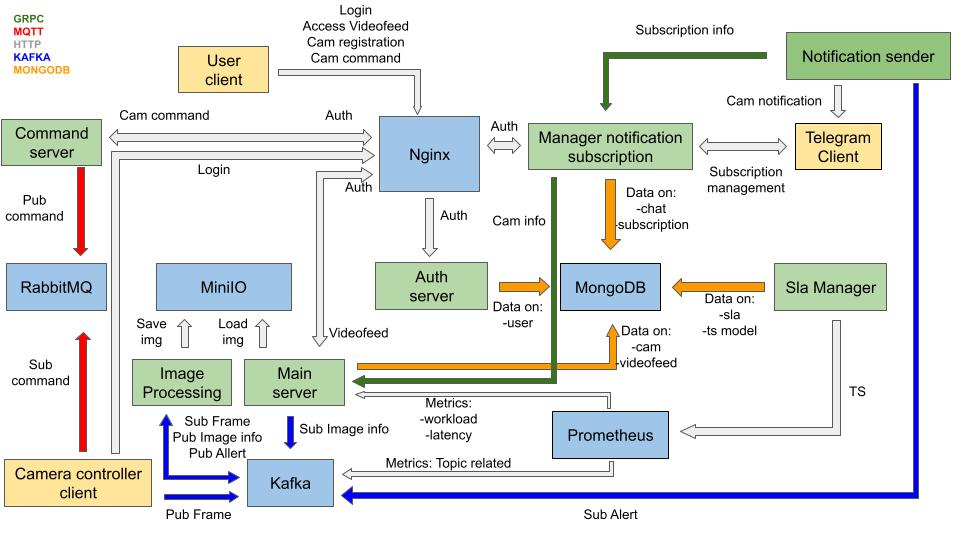

# **Sistema di Monitoraggio delle Telecamere Distribuite**

### **Indice**

1. [Introduzione](#introduzione)
2. [Controllore di Base della Telecamera](#controllore-di-base-della-telecamera)
    - 2.1 [Caratteristiche Principali](#caratteristiche-principali)
    - 2.2 [Potenzialità per Sviluppi Futuri](#potenzialità-per-sviluppi-futuri)
3. [Server di Elaborazione](#server-di-elaborazione)
    - 3.1 [Responsabilità Chiave](#responsabilità-chiave)
    - 3.2 [Deployment Dinamico dei Server](#deployment-dinamico-dei-server)
4. [Server di Autenticazione](#server-di-autenticazione)
    - 4.1 [Caratteristiche Principali](#caratteristiche-principali-1)
    - 4.2 [Misure di Sicurezza](#misure-di-sicurezza)
    - 4.3 [Integrazione con Altri Componenti](#integrazione-con-altri-componenti)
5. [Server Principale](#server-principale)
    - 5.1 [Responsabilità Chiave](#responsabilità-chiave-1)
   -
   5.2 [Miglioramento dell'Esperienza Utente ed Efficienza del Sistema](#miglioramento-dellesperienza-utente-ed-efficienza-del-sistema)
6. [Server dei Comandi](#server-dei-comandi)
   - 6.1 [Responsabilità Chiave](#responsabilità-chiave-1)
   -
   6.2 [Miglioramento della Affidabilità per le Telecamere Remote](#miglioramento-della-affidabilità-per-le-telecamere-remote)
   - 6.3 [Scalabilità e Flessibilità](#scalabilità-e-flessibilità)
7. [Servizio di Sottoscrizione Notifiche](#servizio-di-sottoscrizione-notifiche)
   - 7.1 [Funzionalità Chiave](#funzionalità-chiave)
   -
   7.2 [Miglioramento del Controllo e della Personalizzazione Utente](#miglioramento-del-controllo-e-della-personalizzazione-utente)
   - 7.3 [Integrazione con il Servizio di Notifiche](#integrazione-con-il-servizio-di-notifiche)
8. [Servizio di Notifiche](#servizio-di-notifiche)
   - 8.1 [Funzionalità Chiave](#funzionalità-chiave-1)
   -
   8.2 [Integrazione con il Servizio di Sottoscrizione Notifiche](#integrazione-con-il-servizio-di-sottoscrizione-notifiche)
   - 8.3 [Miglioramento del Coinvolgimento Utente](#miglioramento-del-coinvolgimento-utente)
9. [Archiviazione Coerente dei Dati con MongoDB](#archiviazione-coerente-dei-dati-con-mongodb)
   - 9.1 [Punti Chiave](#punti-chiave)
10. [Gateway API in Kubernetes (K8s)](#gateway-api-in-kubernetes-k8s)
   - 10.1 [Caratteristiche Principali](#caratteristiche-principali-2)
11. [Generazione di URL Pre-firmati da Main Server](#generazione-di-url-pre-firmati-da-main-server)
   - 11.1 [Punti Chiave](#punti-chiave-1)
12. [Conclusioni](#conclusioni)
   - 12.1 [Reattività in Tempo Reale](#reattività-in-tempo-reale)
   - 12.2 [Scaling Dinamico](#scaling-dinamico)
   - 12.3 [Miglioramenti dell'Interfaccia Utente](#miglioramenti-dellinterfaccia-utente)
   - 12.4 [Integrazione con Sistemi Esterni](#integrazione-con-sistemi-esterni)

### **Introduzione:**

Il sistema di monitoraggio delle telecamere distribuite è una soluzione completa che affronta le esigenze della
sorveglianza e del rilevamento degli eventi. Basato su componenti distribuite come Kafka, MongoDB e Kubernetes, il
sistema garantisce una cattura, elaborazione e notifica degli eventi senza compromettere la scalabilità, l'efficienza o
la sicurezza.

Al suo nucleo, il sistema comprende telecamere in varie posizioni, che catturano frame distribuiti a server di
elaborazione tramite Kafka. Questi server, iscritti a un gruppo Kafka comune, applicano collettivamente algoritmi di
riconoscimento dei pedoni e archiviano i frame elaborati in MinIO. Il Server Principale gestisce le informazioni e i
frame della telecamera, mentre il Server di Autenticazione garantisce un accesso sicuro agli utenti. I bot di Telegram,
facilitati dal Servizio di Sottoscrizione Notifiche e dal Servizio di Notifiche, forniscono un'interfaccia per gestire
le notifiche e ricevere avvisi.

Tecnologie come GRPC, formato Proto e Kubernetes Gateway API contribuiscono a un framework di comunicazione sicuro.
L'architettura enfatizza la coerenza dei dati tramite MongoDB, l'accesso sicuro tramite Gateway API e l'accesso diretto
ai frame elaborati tramite URL pre-firmati.

---

### **Controllore di Base della Telecamera:**

**[Src](CPP/src/cam_controller.cpp)**

Il Controllore di Base della Telecamera è il modulo fondamentale nel sistema di monitoraggio delle telecamere,
convalidando le funzionalità di base e supportando eventuali estensioni per funzionalità avanzate.

#### *Caratteristiche Principali:*

1. **Distribuzione di Frame tramite Kafka:**

    - Il controllore cattura i frame e li distribuisce efficientemente a server di elaborazione attraverso un topic
      Kafka dedicato.
    - Utilizza Kafka per la consegna di frame ad alta velocità e tolleranza agli errori.

2. **Elaborazione di Comandi tramite RabbitMQ e MQTT:**

    - Ascolta i comandi tramite RabbitMQ utilizzando il protocollo MQTT.
    - Esegue compiti basati sui comandi ricevuti, consentendo un controllo dinamico del sistema della telecamera.

3. **Standardizzazione dei Messaggi:**

    - I messaggi in ingresso e in uscita seguono il formato Proto standard di Google.
    - Garantisce un protocollo di comunicazione coerente, facilitando l'interoperabilità e l'integrazione con altri
      componenti.

#### *Potenzialità per Sviluppi Futuri:*

- Il design modulare del Controllore di Base della Telecamera consente un'integrazione senza soluzione di continuità di
  funzionalità avanzate. Gli sviluppatori possono utilizzare questo codice come base per implementare ulteriori
  funzioni, migliorando le capacità del sistema di monitoraggio delle telecamere.

<!--In sintesi, il Controllore di Base della Telecamera offre un solido punto di partenza per il sistema di monitoraggio
delle telecamere distribuite, fornendo funzionalità essenziali di distribuzione di frame ed elaborazione di comandi in
un formato standardizzato. -->

---

### **Server di Elaborazione:**

**[Src](CPP/src/processing_server.cpp)**

I server di elaborazione sono fondamentali per il funzionamento efficiente del sistema di monitoraggio delle telecamere
distribuite, concentrandosi sull'applicazione efficace dell'algoritmo di riconoscimento dei pedoni e sulla successiva
gestione delle immagini elaborate.

#### *Responsabilità Chiave:*

1. **Elaborazione Parallelizzata:**

    - Diversi server di elaborazione si iscrivono allo stesso gruppo Kafka su un topic dedicato, consentendo la
      distribuzione del carico di lavoro per l'applicazione dell'algoritmo di riconoscimento dei pedoni.
    - Questo approccio parallelizzato migliora la scalabilità e la reattività, contribuendo all'efficienza del sistema.

2. **Elaborazione Algoritmica e Archiviazione Immagini:**

    - I server di elaborazione applicano l'algoritmo di riconoscimento dei pedoni ai frame ricevuti per un'analisi
      accurata e tempestiva.
    - Le immagini elaborate vengono trasmesse a MinIO per l'archiviazione, stabilendo un repository centralizzato per i
      dati storici.

3. **Segnalazione dei Risultati al Server Principale:**

    - I risultati dell'algoritmo di riconoscimento dei pedoni vengono inviati al server principale per l'archiviazione e
      ulteriore elaborazione.
    - Ciò facilita un'analisi completa e la presa di decisioni basate sulle informazioni rilevate.

4. **Metriche di Utilizzo delle Risorse con Prometheus:**

    - Prometheus è integrato per raccogliere metriche essenziali per ottimizzare l'utilizzo delle risorse.
        - Le metriche di **Tempo Trascorso** catturano la durata dalla creazione del frame all'archiviazione in MinIO,
          fornendo informazioni sull'efficienza dell'elaborazione.
        - Il **Rapporto Lavoro-a-Inattività** valuta il rapporto tra il tempo trascorso a lavorare sui frame e il tempo
          inattivo dei server di elaborazione, contribuendo alle decisioni di allocazione delle risorse.
        - Le Metriche della **Coda dei Messaggi** includono il conteggio dei messaggi in attesa sul topic per
          l'elaborazione e la variazione di questo valore nel tempo, fungendo da base per la distribuzione dinamica dei
          server in base alle fluttuazioni del carico di lavoro.

#### *Deployment Dinamico dei Server:*

- Sfruttando le metriche raccolte, il sistema regola dinamicamente il numero di server di elaborazione deployati,
  garantendo un utilizzo ottimale delle risorse e la reattività a variazioni del carico di lavoro.

<!-- In sintesi, i server di elaborazione contribuiscono alla natura distribuita del sistema attraverso l'elaborazione
parallelizzata, l'ottimizzazione delle risorse mediante metriche di Prometheus e la scalabilità dinamica.-->

---

### **Server di Autenticazione:**

**[Src](GO/src/server_auth/main.go)**

Il Server di Autenticazione svolge un ruolo cruciale nel sistema di monitoraggio delle telecamere distribuite,
stabilendo un meccanismo di accesso sicuro e controllato per gli utenti e le loro telecamere associate.

#### *Caratteristiche Principali:*

1. **Integrazione con MongoDB per la Gestione delle Credenziali Utente:**

    - Il Server di Autenticazione si connette a un server MongoDB per la gestione delle credenziali utente, compresi
      dettagli di autenticazione per utenti e relative telecamere.
    - Concedere privilegi di accesso in base ai ruoli e alle autorizzazioni degli utenti assicura un accesso controllato
      alle funzionalità del sistema.

2. **Autenticazione Utente e Assegnazione delle Credenziali:**

    - Al login avvenuto con successo, il Server di Autenticazione genera una password per la telecamera per l'utente,
      utilizzata dalle telecamere associate per accedere al sistema.
    - Un token temporaneo viene fornito al login, fungendo da identificatore per richieste successive al sistema.

3. **Verifica del Token per l'Autorizzazione delle Richieste:**

    - Ogni richiesta di sistema include un token, verificato dal Server di Autenticazione. L'accesso alla funzionalità
      richiesta è concesso solo al successo della conferma del token, garantendo un ambiente sicuro.
    - L'uso di token temporanei aumenta la sicurezza mediante l'aggiornamento regolare dell'identificazione dell'utente,
      riducendo il rischio di accessi non autorizzati.

4. **Provision delle Credenziali alle Telecamere:**

    - Le telecamere, al login avvenuto con successo, ricevono le credenziali necessarie per accedere ai servizi RabbitMQ
      e Kafka, garantendo un'integrazione senza soluzione di continuità nel sistema distribuito per la comunicazione e
      lo scambio di dati in tempo reale.

#### *Misure di Sicurezza:*

- Il Server di Autenticazione agisce come un guardiano, verificando la legittimità delle richieste e garantendo che solo
  utenti e telecamere autorizzati possano interagire con il sistema.

#### *Integrazione con Altri Componenti:*

- Il Server di Autenticazione svolge un ruolo vitale nell'orchestrare la comunicazione sicura e l'interazione tra
  utenti, telecamere e servizi di sistema, inclusi RabbitMQ e Kafka.

<!-- In sintesi, il Server di Autenticazione stabilisce un robusto framework di autenticazione e autorizzazione, integrandosi
con MongoDB per la gestione delle credenziali e garantendo una comunicazione sicura all'interno del sistema di
monitoraggio delle telecamere distribuite. -->

---

### **Server Principale:**

**[Src](GO/src/server_main/main.go)**

Il Server Principale funge da fulcro centrale nel sistema distribuito di monitoraggio delle telecamere, supervisionando
la gestione delle telecamere, le registrazioni degli utenti e l'archiviazione di frame e informazioni pertinenti.

#### *Responsabilità Chiave:*

1. **Gestione e Registrazione delle Telecamere:**

    - Gli utenti possono registrare nuove telecamere effettuando richieste al Server Principale. L'ID della telecamera
      generato viene successivamente utilizzato per il login della telecamera, agevolando l'integrazione senza soluzione
      di continuità dei nuovi dispositivi.
    - Questo processo di registrazione consente agli utenti di espandere senza sforzo la propria rete di telecamere.

2. **Archiviazione di Informazioni su Frame e Telecamera:**

    - Il Server Principale è responsabile della gestione delle informazioni delle telecamere e dell'archiviazione sicura
      dei frame in MongoDB.
    - I dettagli della telecamera, inclusi l'identificazione e le credenziali di accesso, vengono memorizzati per un
      accesso e una gestione efficienti.

3. **Integrazione con Kafka per Informazioni sui Frame Elaborati:**

    - Il Server Principale è registrato su un topic Kafka dove i server di elaborazione depositano informazioni relative
      ai frame elaborati.
    - Questa integrazione consente al Server Principale di raccogliere dati cruciali sull'elaborazione dei frame,
      migliorando la comprensione complessiva dell'identificazione di MinIO, dettagli aggiuntivi dell'immagine e l'esito
      del riconoscimento dei pedoni.

4. **Accesso degli Utenti ai Flussi Video delle Telecamere:**

    - Attraverso il Server Principale, gli utenti possono accedere ai flussi video delle loro telecamere registrate,
      fornendo capacità di monitoraggio in tempo reale.
    - Questa funzionalità migliora l'esperienza complessiva dell'utente offrendo un accesso senza soluzione di
      continuità ai flussi video delle telecamere.

5. **Recupero di Informazioni per Altri Servizi:**

    - Altri servizi all'interno del sistema possono interrogare il Server Principale per accedere a informazioni sulle
      telecamere registrate, garantendo coerenza e affidabilità nell'accesso ai dettagli delle telecamere.

6. **Notifiche Positive per il Riconoscimento dei Pedoni:**

    - Alla ricezione di messaggi relativi alle immagini elaborate, se un'immagine viene positivamente riconosciuta per i
      pedoni, il Server Principale attiva un messaggio sul topic di notifica su Kafka.
    - Questo messaggio viene quindi elaborato dal Servizio di Notifiche, consentendo agli utenti di ricevere avvisi
      tempestivi e notifiche sull'attività dei pedoni rilevata.

7. **Gestione dell'Eliminazione Automatica di Dati Obsoleti:**

   - Il sistema implementa un meccanismo di pulizia automatica per le immagini salvate su MinIO e le relative
     informazioni memorizzate su MongoDB.
   - Dopo un tempo predefinito, le immagini elaborate archiviate su MinIO e le corrispondenti informazioni su MongoDB
     vengono eliminate per garantire l'ottimizzazione dello spazio di archiviazione e la gestione efficiente delle
     risorse del sistema.
   - Questa pratica assicura che solo dati pertinenti e recenti siano conservati nel sistema, riducendo l'ingombro e
     contribuendo alla performance ottimale del sistema nel lungo termine.

#### *Miglioramento dell'Esperienza Utente ed Efficienza del Sistema:*

- Il Server Principale funge da perno, fornendo un'interfaccia coesa per gli utenti per gestire le telecamere, accedere
  ai flussi video e ricevere notifiche.
- La sua integrazione con Kafka migliora l'efficienza e la reattività del sistema.

<!-- In sintesi, il Server Principale svolge un ruolo cruciale nella gestione delle telecamere, nelle interazioni degli
utenti e nel flusso senza soluzione di continuità delle informazioni all'interno del sistema distribuito di monitoraggio
delle telecamere. -->

---

### **Server dei Comandi:**

**[Src](GO/src/server_command/main.go)**

Il Server dei Comandi svolge un ruolo vitale come componente intermedia nel sistema distribuito di monitoraggio delle
telecamere, consentendo agli utenti di inviare richieste API che vengono efficientemente trasmesse alle telecamere
specificate, affrontando potenziali sfide nelle connessioni remote delle telecamere.

#### *Responsabilità Chiave:*

1. **Ricezione delle Richieste API:**
   - Il Server dei Comandi riceve richieste API dagli utenti, agendo come intermediario tra l'interfaccia utente e le
     telecamere all'interno del sistema.

2. **Formattazione e Standardizzazione dei Comandi:**
   - I comandi ricevuti vengono formattati e standardizzati utilizzando il formato Proto, garantendo un protocollo di
     comunicazione consistente e strutturato.
   - Questa standardizzazione migliora l'interoperabilità e la facilità di integrazione con diversi componenti del
     sistema.

3. **Consegna Affidabile dei Messaggi con MQTT:**
   - L'utilizzo di MQTT come protocollo di comunicazione offre vantaggi in scenari con connessioni potenzialmente
     instabili, come quelli comunemente riscontrati nelle telecamere remote degli utenti.
   - MQTT fornisce la conferma della consegna del messaggio, garantendo che i comandi raggiungano le telecamere
     specificate anche in condizioni di rete difficili.

4. **Comunicazione con RabbitMQ:**
   - I comandi formattati vengono inviati al topic della telecamera specificata all'interno di RabbitMQ tramite MQTT.
   - Ciò stabilisce un canale di comunicazione affidabile ed efficiente tra il Server dei Comandi e le telecamere.

5. **Feedback e Conferma:**
   - Il Server dei Comandi può ricevere feedback e conferme dalle telecamere, consentendo una comunicazione
     bidirezionale.
   - Questo meccanismo di feedback migliora l'esperienza dell'utente fornendo informazioni sullo stato di esecuzione
     dei comandi emessi.

#### *Miglioramento della Affidabilità per le Telecamere Remote:*

- La scelta di MQTT come protocollo di comunicazione è strategica, offrendo una consegna affidabile dei messaggi e la
  conferma anche in situazioni in cui le connessioni di rete sono meno stabili.

#### *Scalabilità e Flessibilità:*

- Il design del Server dei Comandi consente la scalabilità, accomodando un numero crescente di utenti e telecamere, e la
  sua flessibilità permette l'integrazione senza soluzione di continuità con varie interfacce utente.

<!--In sintesi, il Server dei Comandi svolge un ruolo cruciale nel facilitare i comandi degli utenti, formattandoli e standardizzandoli, e garantendo una consegna affidabile alle telecamere remote attraverso l'infrastruttura robusta di MQTT e RabbitMQ.-->

---

### **Servizio di Sottoscrizione Notifiche:**

**[Src](Python/src/conversation_bot/main.py)**

Il Servizio di Sottoscrizione Notifiche è un bot Telegram che intrattiene conversazioni con gli utenti sulla piattaforma
Telegram, offrendo un'interfaccia senza soluzione di continuità per gestire le preferenze e le sottoscrizioni alle
notifiche degli utenti.

#### *Funzionalità Chiave:*

1. **Bot Telegram per l'Interazione con l'Utente:**

    - Operando come un bot Telegram, il servizio consente agli utenti di accedere direttamente alle sue funzionalità
      attraverso la piattaforma Telegram.
    - Gli utenti si autenticano con le proprie credenziali per stabilire una connessione sicura.

2. **Archiviazione dell'ID Utente:**

    - Il servizio memorizza l'ID utente di Telegram per mantenere un registro della conversazione e delle preferenze
      dell'utente, fungendo da identificatore chiave per associare gli utenti alle loro preferenze di notifica.

3. **Gestione delle Sottoscrizioni:**

    - Gli utenti possono gestire le preferenze di notifica, incluso l'abbonamento alle telecamere di loro proprietà.
    - Dettagli di sottoscrizione, come l'intervallo di tempo tra le notifiche e l'orario preferito per ricevere
      notifiche, possono essere specificati dall'utente.

4. **Funzione di Annullamento dell'Abbonamento:**

    - Gli utenti possono annullare l'abbonamento per non ricevere notifiche per una telecamera specifica, offrendo
      flessibilità e assicurando che gli utenti ricevano solo notifiche rilevanti.

5. **Interfaccia GRPC per il Recupero delle Informazioni:**

    - Il Servizio di Sottoscrizione Notifiche espone un'interfaccia GRPC per consentire ad altri componenti, come il
      Servizio di Notifiche, di ottenere efficientemente le informazioni necessarie sulle sottoscrizioni degli utenti.

#### *Miglioramento del Controllo e della Personalizzazione Utente:*

- Il servizio dà potere agli utenti permettendo loro di personalizzare le preferenze di notifica, specificando le
  telecamere di interesse, l'orario delle notifiche e la possibilità di optare per l'uscita in qualsiasi momento.

#### *Integrazione con il Servizio di Notifiche:*

- Il Servizio di Sottoscrizione Notifiche si integra senza soluzione di continuità con il Servizio di Notifiche
  attraverso l'interfaccia GRPC, fornendo un canale di comunicazione strutturato ed efficiente.

<!-- In sintesi, il Servizio di Sottoscrizione Notifiche funge da interfaccia utente amichevole sulla piattaforma Telegram,
consentendo agli utenti di gestire le loro preferenze di notifica e interagire con il più ampio sistema di notifiche.-->
---

### **Servizio di Notifiche:**

**[Src](Python/src/notification_bot/main.py)**

Il Servizio di Notifiche è un bot Telegram responsabile del consumo di messaggi dal topic di notifica Kafka e della
notifica efficiente degli utenti che hanno manifestato interesse in specifiche notifiche.

#### *Funzionalità Chiave:*

1. **Consumo di Messaggi da Kafka:**

    - Il Servizio di Notifiche consuma continuamente i messaggi dal topic di notifica Kafka (ad esempio, "alert").
    - Questi messaggi contengono tipicamente informazioni su un riconoscimento positivo di pedoni o altri eventi che
      attivano le notifiche.

2. **Recupero delle Informazioni sugli Utenti:**

    - Con ogni messaggio consumato, il Servizio di Notifiche richiede informazioni al Servizio di Sottoscrizione
      Notifiche tramite l'interfaccia GRPC.
    - Questa richiesta aiuta a identificare tutti gli utenti interessati a ricevere notifiche relative all'evento
      specifico menzionato nel messaggio Kafka.

3. **Notifiche Telegram:**

    - Il servizio utilizza gli ID di Telegram registrati ottenuti dal Servizio di Sottoscrizione Notifiche per
      notificare gli utenti sull'evento.
    - Le notifiche vengono inviate direttamente agli utenti sulla piattaforma Telegram, fornendo avvisi in tempo reale
      su attività rilevanti dal sistema di monitoraggio delle telecamere.

4. **Mirato Efficientemente agli Utenti:**

    - Sfruttando le informazioni ottenute dal Servizio di Sottoscrizione Notifiche, il Servizio di Notifiche garantisce
      che le notifiche siano indirizzate solo agli utenti che hanno manifestato interesse in eventi specifici della
      telecamera.

5. **Scalabilità e Reattività:**

    - Il design del Servizio di Notifiche supporta la scalabilità, gestendo efficientemente un numero crescente di
      notifiche e utenti.
    - Il servizio risponde prontamente ai messaggi Kafka in arrivo, garantendo notifiche tempestive agli utenti
      interessati.

#### *Integrazione con il Servizio di Sottoscrizione Notifiche:*

- Il Servizio di Notifiche si basa sull'interfaccia GRPC fornita dal Servizio di Sottoscrizione Notifiche per ottenere
  informazioni aggiornate sulle sottoscrizioni degli utenti.
- Questa integrazione migliora l'efficienza complessiva e l'accuratezza nel mirare gli utenti durante il processo di
  notifica.

#### *Miglioramento del Coinvolgimento Utente:*

- Il Servizio di Notifiche contribuisce all'coinvolgimento degli utenti consegnando notifiche pertinenti e tempestive,
  tenendo gli utenti informati sugli eventi catturati dal sistema di monitoraggio delle telecamere.

<!--In sintesi, il Servizio di Notifiche svolge un ruolo cruciale nell'ultimo passo del processo di notifica, garantendo che
gli utenti che si sono abbonati a eventi specifici ricevano avvisi tempestivi e personalizzati sulla piattaforma
Telegram.-->

---

### **Archiviazione Coerente dei Dati con MongoDB:**

MongoDB funge da repository centrale per i dati elaborati all'interno del sistema di monitoraggio delle telecamere. Ogni
categoria di dati è accessibile attraverso un componente singolare, garantendo coerenza dei dati e fornendo un approccio
strutturato al recupero dei dati.

#### *Punti Chiave:*

1. **Archiviazione Centralizzata dei Dati:**

    - MongoDB funge da database centralizzato per archiviare varie categorie di dati, mantenendo un approccio
      strutturato e organizzato alla gestione dei dati.

2. **Accesso a Componente Singolare:**

    - Per mantenere la coerenza dei dati, ogni categoria di dati è accessibile attraverso un componente singolare,
      minimizzando il rischio di inconsistenze dei dati e garantendo interazioni ben definite con tipi di dati
      specifici.

---

### **Gateway API in Kubernetes (K8s):**

Una Gateway API è implementata all'interno del cluster Kubernetes (K8s), fornendo uno strato di astrazione e sicurezza
per i servizi con cui interagiscono utenti e client telecamera. Questo gateway maschera gli indirizzi IP reali,
migliorando la sicurezza e fornendo URL più amichevoli all'utente.

#### *Caratteristiche Principali:*

1. **Mascheramento e Sicurezza degli IP:**

    - La Gateway API maschera gli indirizzi IP reali dei servizi sottostanti, aggiungendo uno strato di sicurezza che
      nasconde i dettagli interni agli utenti esterni.

2. **URL più Amichevoli all'Utente:**

    - La Gateway API fornisce URL più amichevoli e sicuri per consentire agli utenti e ai client telecamera di
      interagire con vari servizi nel sistema.

---

### **Generazione di URL Pre-firmati da Main Server:**

Il Server Principale facilita l'accesso diretto ai frame elaborati archiviati in MinIO generando URL pre-firmati. Questo
approccio minimizza intermediari non necessari, ottimizzando la velocità e fornendo agli utenti un accesso efficiente ai
dati archiviati.

#### *Punti Chiave:*

1. **Creazione di URL Pre-firmati:**

    - Il Server Principale crea URL pre-firmati per i frame elaborati archiviati in MinIO.
    - Gli utenti possono accedere direttamente all'archiviazione MinIO senza intermediari, riducendo la latenza e
      massimizzando la velocità.

---

### **Conclusioni:**

Nonostante il sistema di monitoraggio delle telecamere distribuito presenti una soluzione robusta e ben integrata, ci
sono aree che potrebbero essere ulteriormente ottimizzate per migliorare le prestazioni e l'esperienza utente. In
particolare:

#### **Reattività in Tempo Reale:**

- Nonostante l'efficienza complessiva del sistema, potrebbero essere esplorate ulteriori ottimizzazioni per migliorare
  la reattività in tempo reale, specialmente in scenari con carichi di lavoro variabili.

#### **Scaling Dinamico:**

- Il sistema potrebbe beneficiare di meccanismi più avanzati per il scaling dinamico, regolando automaticamente il
  numero di server di elaborazione in base a metriche in tempo reale per garantire un utilizzo ottimale delle risorse.

#### **Miglioramenti dell'Interfaccia Utente:**

- L'interfaccia utente, specialmente nei bot Telegram, potrebbe essere perfezionata per offrire più funzionalità e una
  maggiore fluidità nell'esperienza utente, integrando potenzialmente contenuti multimediali o comandi aggiuntivi per
  una interazione potenziata.

#### **Integrazione con Sistemi Esterni:**

- Esplorare possibilità di integrazione del sistema con servizi esterni o framework di intelligenza artificiale potrebbe
  potenziare ulteriormente le capacità di riconoscimento dei pedoni e l'intelligenza complessiva del sistema.

In conclusione, il sistema di monitoraggio delle telecamere distribuito rappresenta una potente soluzione con una base
solida. Un continuo perfezionamento e ottimizzazione nelle aree menzionate potrebbe spingere il sistema a nuovi livelli,
rispondendo alle esigenze in evoluzione e stabilendo nuovi standard per efficienza e soddisfazione dell'utente.