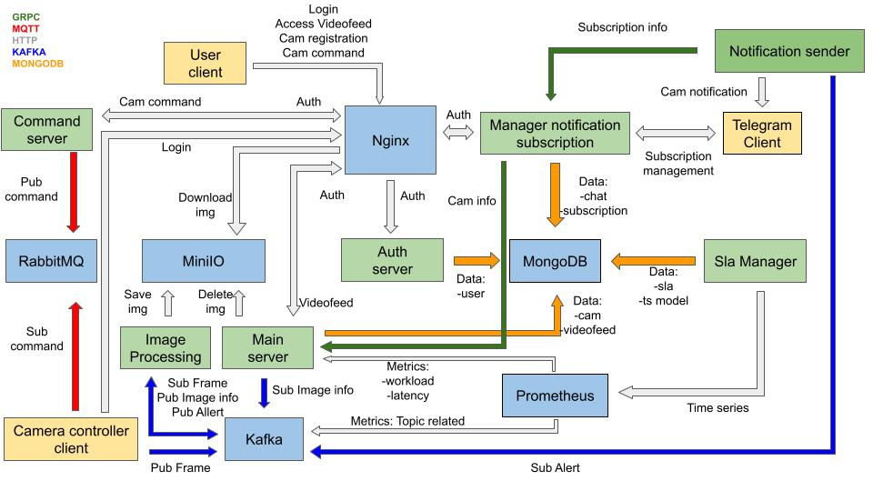

# **Sistema di Monitoraggio delle Telecamere Distribuite**

### **Indice**

1. [Introduzione](#introduzione)
2. [Controllore di Base della Telecamera](#controllore-di-base-della-telecamera)
    - 2.1 [Caratteristiche Principali](#caratteristiche-principali)
3. [Server di Elaborazione](#server-di-elaborazione)
    - 3.1 [Responsabilità Chiave](#responsabilità-chiave)
4. [Server di Autenticazione](#server-di-autenticazione)
    - 4.1 [Caratteristiche Principali](#caratteristiche-principali-1)
5. [Server Principale](#server-principale)
    - 5.1 [Responsabilità Chiave](#responsabilità-chiave-1)
6. [Server dei Comandi](#server-dei-comandi)
    - 6.1 [Responsabilità Chiave](#responsabilità-chiave-1)
7. [Servizio di Sottoscrizione Notifiche](#servizio-di-sottoscrizione-notifiche)
    - 7.1 [Funzionalità Chiave](#funzionalità-chiave)
8. [Servizio di Notifiche](#servizio-di-notifiche)
    - 8.1 [Funzionalità Chiave](#funzionalità-chiave-1)
9. [Scelte Implementative Principali](#scelte-implementative-principali)
    - 9.1 [CPP](#CPP)
    - 9.2 [GO](#go)
    - 9.3 [Python](#python)

### **Introduzione:**

Il sistema di monitoraggio delle telecamere distribuite è una soluzione completa che affronta le esigenze della
sorveglianza e del rilevamento degli eventi. Basato su componenti distribuite come Kafka, MongoDB e Kubernetes, il
sistema garantisce una cattura, elaborazione e notifica degli eventi senza compromettere la scalabilità, l'efficienza o
la sicurezza.

Al suo nucleo, il sistema comprende telecamere in varie posizioni, che catturano frame distribuiti a server di
elaborazione tramite Kafka. Questi server, iscritti a un gruppo Kafka comune, applicano collettivamente algoritmi di
riconoscimento dei pedoni e archiviano i frame elaborati in MinIO. Il Server Principale gestisce le informazioni e i
frame della telecamera, mentre il Server di Autenticazione garantisce un accesso sicuro agli utenti. I bot di Telegram,
facilitati dal Servizio di Sottoscrizione Notifiche e dal Servizio di Notifiche, forniscono un'interfaccia per gestire
le notifiche e ricevere avvisi.

Tecnologie come GRPC, formato Proto e Kubernetes Gateway API contribuiscono a un framework di comunicazione sicuro.
L'architettura enfatizza la coerenza dei dati tramite MongoDB, l'accesso sicuro tramite Gateway API e l'accesso diretto
ai frame elaborati tramite URL pre-firmati.

---

### **Controllore di Base della Telecamera:**

**[Src](CPP/src/cam_controller.cpp)**

Il Controllore di Base della Telecamera è il modulo fondamentale nel sistema di monitoraggio delle telecamere,
convalidando le funzionalità di base e supportando eventuali estensioni per funzionalità avanzate.

#### *Caratteristiche Principali:*

1. **Distribuzione di Frame tramite Kafka:**

    - Il controllore cattura i frame e li distribuisce efficientemente a server di elaborazione attraverso un topic
      Kafka dedicato.
    - Utilizza Kafka per la consegna di frame ad alta velocità e tolleranza agli errori.

2. **Elaborazione di Comandi tramite RabbitMQ e MQTT:**

    - Ascolta i comandi tramite RabbitMQ utilizzando il protocollo MQTT.
    - Esegue compiti basati sui comandi ricevuti, consentendo un controllo dinamico del sistema della telecamera.

3. **Standardizzazione dei Messaggi:**

    - I messaggi in ingresso e in uscita seguono il formato Proto standard di Google.
    - Garantisce un protocollo di comunicazione coerente, facilitando l'interoperabilità e l'integrazione con altri
      componenti.

<!--In sintesi, il Controllore di Base della Telecamera offre un solido punto di partenza per il sistema di monitoraggio
delle telecamere distribuite, fornendo funzionalità essenziali di distribuzione di frame ed elaborazione di comandi in
un formato standardizzato. -->

---

### **Server di Elaborazione:**

**[Src](CPP/src/processing_server.cpp)**

I server di elaborazione sono fondamentali per il funzionamento efficiente del sistema di monitoraggio delle telecamere
distribuite, concentrandosi sull'applicazione efficace dell'algoritmo di riconoscimento dei pedoni e sulla successiva
gestione delle immagini elaborate.

#### *Responsabilità Chiave:*

1. **Elaborazione Parallelizzata:**

    - Diversi server di elaborazione si iscrivono allo stesso gruppo Kafka su un topic dedicato, consentendo la
      distribuzione del carico di lavoro per l'applicazione dell'algoritmo di riconoscimento dei pedoni.
    - Questo approccio parallelizzato migliora la scalabilità e la reattività, contribuendo all'efficienza del sistema.

2. **Elaborazione Algoritmica e Archiviazione Immagini:**

    - I server di elaborazione applicano l'algoritmo di riconoscimento dei pedoni ai frame ricevuti per un'analisi
      accurata e tempestiva.
    - Le immagini elaborate vengono trasmesse a MinIO per l'archiviazione, stabilendo un repository centralizzato per i
      dati storici.

3. **Segnalazione dei Risultati al Server Principale:**

    - I risultati dell'algoritmo di riconoscimento dei pedoni vengono inviati al server principale per l'archiviazione e
      ulteriore elaborazione.
    - Ciò facilita un'analisi completa e la presa di decisioni basate sulle informazioni rilevate.

4. **Metriche di Utilizzo delle Risorse con Prometheus:**

    - Prometheus è integrato per raccogliere metriche essenziali per ottimizzare l'utilizzo delle risorse.
        - Le metriche di **Tempo Trascorso** catturano la durata dalla creazione del frame all'archiviazione in MinIO,
          fornendo informazioni sull'efficienza dell'elaborazione.
        - Il **Rapporto Lavoro-a-Inattività** valuta il rapporto tra il tempo trascorso a lavorare sui frame e il tempo
          inattivo dei server di elaborazione, contribuendo alle decisioni di allocazione delle risorse.
        - Le Metriche della **Coda dei Messaggi** includono il conteggio dei messaggi in attesa sul topic per
          l'elaborazione e la variazione di questo valore nel tempo, fungendo da base per la distribuzione dinamica dei
          server in base alle fluttuazioni del carico di lavoro.

<!-- In sintesi, i server di elaborazione contribuiscono alla natura distribuita del sistema attraverso l'elaborazione
parallelizzata, l'ottimizzazione delle risorse mediante metriche di Prometheus e la scalabilità dinamica.-->

---

### **Server di Autenticazione:**

**[Src](GO/src/server_auth/main.go)**

Il Server di Autenticazione svolge un ruolo cruciale nel sistema di monitoraggio delle telecamere distribuite,
stabilendo un meccanismo di accesso sicuro e controllato per gli utenti e le loro telecamere associate.

#### *Caratteristiche Principali:*

1. **Integrazione con MongoDB per la Gestione delle Credenziali Utente:**

    - Il Server di Autenticazione si connette a un server MongoDB per la gestione delle credenziali utente, compresi
      dettagli di autenticazione per utenti e relative telecamere.
    - Concedere privilegi di accesso in base ai ruoli e alle autorizzazioni degli utenti assicura un accesso controllato
      alle funzionalità del sistema.

2. **Autenticazione Utente e Assegnazione delle Credenziali:**

    - Al login avvenuto con successo, il Server di Autenticazione genera una password per la telecamera per l'utente,
      utilizzata dalle telecamere associate per accedere al sistema.
    - Un token temporaneo viene fornito al login, fungendo da identificatore per richieste successive al sistema.

3. **Verifica del Token per l'Autorizzazione delle Richieste:**

    - Ogni richiesta di sistema include un token, verificato dal Server di Autenticazione. L'accesso alla funzionalità
      richiesta è concesso solo al successo della conferma del token, garantendo un ambiente sicuro.
    - L'uso di token temporanei aumenta la sicurezza mediante l'aggiornamento regolare dell'identificazione dell'utente,
      riducendo il rischio di accessi non autorizzati.

4. **Provision delle Credenziali alle Telecamere:**

    - Le telecamere, al login avvenuto con successo, ricevono le credenziali necessarie per accedere ai servizi RabbitMQ
      e Kafka, garantendo un'integrazione senza soluzione di continuità nel sistema distribuito per la comunicazione e
      lo scambio di dati in tempo reale.

<!-- In sintesi, il Server di Autenticazione stabilisce un robusto framework di autenticazione e autorizzazione, integrandosi
con MongoDB per la gestione delle credenziali e garantendo una comunicazione sicura all'interno del sistema di
monitoraggio delle telecamere distribuite. -->

---

### **Server Principale:**

**[Src](GO/src/server_main/main.go)**

Il Server Principale funge da fulcro centrale nel sistema distribuito di monitoraggio delle telecamere, supervisionando
la gestione delle telecamere, le registrazioni degli utenti e l'archiviazione di frame e informazioni pertinenti.

#### *Responsabilità Chiave:*

1. **Gestione e Registrazione delle Telecamere:**

    - Gli utenti possono registrare nuove telecamere effettuando richieste al Server Principale. L'ID della telecamera
      generato viene successivamente utilizzato per il login della telecamera, agevolando l'integrazione senza soluzione
      di continuità dei nuovi dispositivi.
    - Questo processo di registrazione consente agli utenti di espandere senza sforzo la propria rete di telecamere.

2. **Archiviazione di Informazioni su Frame e Telecamera:**

    - Il Server Principale è responsabile della gestione delle informazioni delle telecamere e dell'archiviazione sicura
      dei frame in MongoDB.
    - I dettagli della telecamera, inclusi l'identificazione e le credenziali di accesso, vengono memorizzati per un
      accesso e una gestione efficienti.

3. **Integrazione con Kafka per Informazioni sui Frame Elaborati:**

    - Il Server Principale è registrato su un topic Kafka dove i server di elaborazione depositano informazioni relative
      ai frame elaborati.
    - Questa integrazione consente al Server Principale di raccogliere dati cruciali sull'elaborazione dei frame,
      migliorando la comprensione complessiva dell'identificazione di MinIO, dettagli aggiuntivi dell'immagine e l'esito
      del riconoscimento dei pedoni.

4. **Accesso degli Utenti ai Flussi Video delle Telecamere:**

    - Attraverso il Server Principale, gli utenti possono accedere ai flussi video delle loro telecamere registrate,
      fornendo capacità di monitoraggio in tempo reale.
    - Questa funzionalità migliora l'esperienza complessiva dell'utente offrendo un accesso senza soluzione di
      continuità ai flussi video delle telecamere.

5. **Recupero di Informazioni per Altri Servizi:**

    - Altri servizi all'interno del sistema possono interrogare il Server Principale per accedere a informazioni sulle
      telecamere registrate, garantendo coerenza e affidabilità nell'accesso ai dettagli delle telecamere.

6. **Notifiche Positive per il Riconoscimento dei Pedoni:**

    - Alla ricezione di messaggi relativi alle immagini elaborate, se un'immagine viene positivamente riconosciuta per i
      pedoni, il Server Principale attiva un messaggio sul topic di notifica su Kafka.
    - Questo messaggio viene quindi elaborato dal Servizio di Notifiche, consentendo agli utenti di ricevere avvisi
      tempestivi e notifiche sull'attività dei pedoni rilevata.

7. **Gestione dell'Eliminazione Automatica di Dati Obsoleti:**

    - Il sistema implementa un meccanismo di pulizia automatica per le immagini salvate su MinIO e le relative
      informazioni memorizzate su MongoDB.
    - Dopo un tempo predefinito, le immagini elaborate archiviate su MinIO e le corrispondenti informazioni su MongoDB
      vengono eliminate per garantire l'ottimizzazione dello spazio di archiviazione e la gestione efficiente delle
      risorse del sistema.
    - Questa pratica assicura che solo dati pertinenti e recenti siano conservati nel sistema, riducendo l'ingombro e
      contribuendo alla performance ottimale del sistema nel lungo termine.

<!-- In sintesi, il Server Principale svolge un ruolo cruciale nella gestione delle telecamere, nelle interazioni degli
utenti e nel flusso senza soluzione di continuità delle informazioni all'interno del sistema distribuito di monitoraggio
delle telecamere. -->

---

### **Server dei Comandi:**

**[Src](GO/src/server_command/main.go)**

Il Server dei Comandi svolge un ruolo vitale come componente intermedia nel sistema distribuito di monitoraggio delle
telecamere, consentendo agli utenti di inviare richieste API che vengono efficientemente trasmesse alle telecamere
specificate, affrontando potenziali sfide nelle connessioni remote delle telecamere.

#### *Responsabilità Chiave:*

1. **Ricezione delle Richieste API:**
    - Il Server dei Comandi riceve richieste API dagli utenti, agendo come intermediario tra l'interfaccia utente e le
      telecamere all'interno del sistema.

2. **Formattazione e Standardizzazione dei Comandi:**
    - I comandi ricevuti vengono formattati e standardizzati utilizzando il formato Proto, garantendo un protocollo di
      comunicazione consistente e strutturato.
    - Questa standardizzazione migliora l'interoperabilità e la facilità di integrazione con diversi componenti del
      sistema.

3. **Consegna Affidabile dei Messaggi con MQTT:**
    - L'utilizzo di MQTT come protocollo di comunicazione offre vantaggi in scenari con connessioni potenzialmente
      instabili, come quelli comunemente riscontrati nelle telecamere remote degli utenti.
    - MQTT fornisce la conferma della consegna del messaggio, garantendo che i comandi raggiungano le telecamere
      specificate anche in condizioni di rete difficili.

4. **Comunicazione con RabbitMQ:**
    - I comandi formattati vengono inviati al topic della telecamera specificata all'interno di RabbitMQ tramite MQTT.
    - Ciò stabilisce un canale di comunicazione affidabile ed efficiente tra il Server dei Comandi e le telecamere.

5. **Feedback e Conferma:**
    - Il Server dei Comandi può ricevere feedback e conferme dalle telecamere, consentendo una comunicazione
      bidirezionale.
    - Questo meccanismo di feedback migliora l'esperienza dell'utente fornendo informazioni sullo stato di esecuzione
      dei comandi emessi.

<!--In sintesi, il Server dei Comandi svolge un ruolo cruciale nel facilitare i comandi degli utenti, formattandoli e standardizzandoli, e garantendo una consegna affidabile alle telecamere remote attraverso l'infrastruttura robusta di MQTT e RabbitMQ.-->

---

### **Servizio di Sottoscrizione Notifiche:**

**[Src](Python/src/conversation_bot/main.py)**

Il Servizio di Sottoscrizione Notifiche è un bot Telegram che intrattiene conversazioni con gli utenti sulla piattaforma
Telegram, offrendo un'interfaccia senza soluzione di continuità per gestire le preferenze e le sottoscrizioni alle
notifiche degli utenti.

#### *Funzionalità Chiave:*

1. **Bot Telegram per l'Interazione con l'Utente:**

    - Operando come un bot Telegram, il servizio consente agli utenti di accedere direttamente alle sue funzionalità
      attraverso la piattaforma Telegram.
    - Gli utenti si autenticano con le proprie credenziali per stabilire una connessione sicura.

2. **Archiviazione dell'ID Utente:**

    - Il servizio memorizza l'ID utente di Telegram per mantenere un registro della conversazione e delle preferenze
      dell'utente, fungendo da identificatore chiave per associare gli utenti alle loro preferenze di notifica.

3. **Gestione delle Sottoscrizioni:**

    - Gli utenti possono gestire le preferenze di notifica, incluso l'abbonamento alle telecamere di loro proprietà.
    - Dettagli di sottoscrizione, come l'intervallo di tempo tra le notifiche e l'orario preferito per ricevere
      notifiche, possono essere specificati dall'utente.

4. **Funzione di Annullamento dell'Abbonamento:**

    - Gli utenti possono annullare l'abbonamento per non ricevere notifiche per una telecamera specifica, offrendo
      flessibilità e assicurando che gli utenti ricevano solo notifiche rilevanti.

5. **Interfaccia GRPC per il Recupero delle Informazioni:**

    - Il Servizio di Sottoscrizione Notifiche espone un'interfaccia GRPC per consentire ad altri componenti, come il
      Servizio di Notifiche, di ottenere efficientemente le informazioni necessarie sulle sottoscrizioni degli utenti.

---

### **Servizio di Notifiche:**

**[Src](Python/src/notification_bot/main.py)**

Il Servizio di Notifiche è un bot Telegram responsabile del consumo di messaggi dal topic di notifica Kafka e della
notifica efficiente degli utenti che hanno manifestato interesse in specifiche notifiche.

#### *Funzionalità Chiave:*

1. **Consumo di Messaggi da Kafka:**

    - Il Servizio di Notifiche consuma continuamente i messaggi dal topic di notifica Kafka (ad esempio, "alert").
    - Questi messaggi contengono tipicamente informazioni su un riconoscimento positivo di pedoni o altri eventi che
      attivano le notifiche.

2. **Recupero delle Informazioni sugli Utenti:**

    - Con ogni messaggio consumato, il Servizio di Notifiche richiede informazioni al Servizio di Sottoscrizione
      Notifiche tramite l'interfaccia GRPC.
    - Questa richiesta aiuta a identificare tutti gli utenti interessati a ricevere notifiche relative all'evento
      specifico menzionato nel messaggio Kafka.

3. **Notifiche Telegram:**

    - Il servizio utilizza gli ID di Telegram registrati ottenuti dal Servizio di Sottoscrizione Notifiche per
      notificare gli utenti sull'evento.
    - Le notifiche vengono inviate direttamente agli utenti sulla piattaforma Telegram, fornendo avvisi in tempo reale
      su attività rilevanti dal sistema di monitoraggio delle telecamere.

4. **Mirato Efficientemente agli Utenti:**

    - Sfruttando le informazioni ottenute dal Servizio di Sottoscrizione Notifiche, il Servizio di Notifiche garantisce
      che le notifiche siano indirizzate solo agli utenti che hanno manifestato interesse in eventi specifici della
      telecamera.

5. **Scalabilità e Reattività:**

    - Il design del Servizio di Notifiche supporta la scalabilità, gestendo efficientemente un numero crescente di
      notifiche e utenti.
    - Il servizio risponde prontamente ai messaggi Kafka in arrivo, garantendo notifiche tempestive agli utenti
      interessati.

---

### *Scelte Implementative Principali:*

#### CPP

1. **Programmazione Funzionale per Incapsulamento e Separazione delle Dipendenze:**

    - La separazione delle dipendenze è ottenuta attraverso il passaggio di funzioni come argomenti. Questo permette di sostituire facilmente le implementazioni specifiche delle funzioni senza dover modificare il codice sorgente principale. Inoltre, la gestione delle dipendenze diventa più flessibile e consente una migliore testabilità del codice.

    - L'approccio alla programmazione funzionale contribuisce alla creazione di un sistema più robusto e manutenibile, fornendo una chiara separazione tra le responsabilità delle varie componenti.

2. **Utilizzo di `std::shared_ptr` per Gestione Sicura della Memoria:**

    - Dove è necessario dichiarare oggetti dinamicamente per una gestione flessibile e sicura della memoria, si fa ampio uso di `std::shared_ptr`. Questa scelta consente di condividere la proprietà degli oggetti dinamici tra più parti del sistema, evitando così potenziali errori di gestione della memoria come memory leaks o dangling pointers.

3. **Gestione della Concorrenza e Graceful Shutdown:**

    - Al fine di gestire la concorrenza tra i thread e garantire una terminazione sicura del sistema, vengono utilizzati meccanismi di sincronizzazione come mutex e condition_variable. Questi strumenti sono implementati per garantire l'accesso atomico a risorse condivise e sincronizzare le attività dei vari thread.

    - La gestione dei segnali del sistema è implementata per permettere un meccanismo di graceful shutdown. Quando viene ricevuto un segnale di shutdown, si attiva un processo di chiusura ordinata. I mutex e le condition_variable sono utilizzati per coordinare l'arresto ordinato delle attività dei vari thread, evitando la perdita di dati o altre problematiche associate a uno shutdown improvviso.

4. **Implementazione di un Logger con Overloading degli Operatori:**

    - Per garantire una registrazione efficace e personalizzata delle attività del sistema, è stata incorpora una classe Logger dedicata. Questa classe sfrutta l'overloading degli operatori per semplificare la sintassi di registrazione e migliorare la leggibilità del codice.

#### GO

1. **Utilizzo di Goroutine, Channel e WaitGroup per la Concorrenza:**

    - Go routine sono ampiamente utilizzate per abilitare l'esecuzione concorrente delle varie funzionalità del sistema. Ogni funzionalità può essere eseguita in modo indipendente, permettendo al sistema di sfruttare al massimo le architetture multi-core.

    - I channel sono utilizzati per facilitare la comunicazione sincrona tra le go routine. Questi canali consentono il passaggio di dati in modo sicuro e coordinato tra le diverse parti del sistema, facilitando la sincronizzazione tra le attività parallele.

    - Un WaitGroup è impiegato per coordinare l'esecuzione delle go routine e attendere che tutte siano completate prima di procedere. Questo è particolarmente rilevante durante la fase di graceful shutdown, in cui il sistema deve attendere che tutte le go routine terminino prima di chiudere in modo sicuro tutte le risorse.

2. **Integrazione di Interfacce e Template per Gestire la Dipendenza:**

    - Le interfacce sono ampiamente utilizzate in combinazione con i template per dichiarare le funzionalità che gli oggetti devono implementare. Questo approccio permette una maggiore flessibilità nella gestione delle dipendenze, consentendo di specificare i requisiti delle funzionalità richieste tramite interfacce senza conoscere la struttura interna degli oggetti.

    - L'utilizzo congiunto di interfacce e template favorisce l'incapsulamento e riduce la dipendenza diretta dalle implementazioni specifiche degli oggetti. Ciò promuove la modularità e la manutenibilità del codice, consentendo alle classi di interagire con gli oggetti basandosi sulle funzionalità dichiarate nell'interfaccia, senza dover conoscere la struttura dettagliata degli oggetti.

    - Questa approccio è particolarmente utile per gestire dipendenze tra strutture e ridurre le problematiche relative agli import circolari, offrendo un meccanismo dichiarativo per definire le relazioni tra le componenti del sistema.

3. **Utilizzo di Embedded Struct per la Specializzazione delle Classi:**

    - Le embedded struct sono state impiegate per realizzare una specializzazione delle classi dove necessario. Questo approccio consente di incorporare il comportamento e le proprietà di una struct all'interno di un'altra, permettendo così una sorta di ereditarietà leggera.

    - L'utilizzo di embedded struct insieme alle interfacce offre una modalità di composizione che favorisce la riusabilità del codice.

4. **Utilizzo di Metadati per la Corrispondenza tra Struct, JSON e Database:**

    - I metadati sono stati impiegati per dichiarare la corrispondenza tra le struct, la loro rappresentazione in JSON e la struttura nel database. Questo approccio consente di associare informazioni aggiuntive a vari campi delle struct, specificando come devono essere trattati durante le conversioni tra diverse rappresentazioni.

    - Le librerie utilizzate fanno ampio uso dei meccanismi di reflection di Go per interpretare i metadati associati alle struct. Questo consente alle librerie di automatizzare il processo di conversione tra oggetti Go, JSON e dati nel database senza richiedere codice aggiuntivo per ogni campo o ogni operazione di conversione.

    - L'utilizzo di metadati semplifica la gestione della serializzazione e deserializzazione dei dati, riducendo la duplicazione di codice e migliorando la manutenibilità. Inoltre, offre un modo dichiarativo per specificare come i dati dovrebbero essere rappresentati in diverse situazioni, facilitando la coerenza tra le varie parti del sistema.

5. **Programmazione Funzionale per Incapsulamento e Separazione delle Dipendenze:**

    - Analogamente a quanto implementato in C++, anche in Go è stata adottata la programmazione funzionale come approccio chiave per migliorare l'incapsulamento e la separazione delle dipendenze.

6. **Sfruttamento del Middleware di Gin come Decoratore:**

    - Nel contesto di Gin, il meccanismo di middleware è stato sfruttato come un potente strumento di decorazione. I middleware di Gin consentono di eseguire operazioni specifiche prima o dopo l'elaborazione di una richiesta HTTP, agendo così come dei veri e propri decoratori.

    - È stato integrato un middleware personalizzato per arricchire le richieste HTTP gestite dal sistema. In particolare, è stato aggiunto un logger personalizzato attraverso il middleware per registrare informazioni dettagliate sulle richieste, agevolando la diagnostica e il monitoraggio del sistema.

    - Ulteriori controlli e logiche personalizzate sono stati implementati attraverso il middleware per aggiungere strati di funzionalità alle richieste gestite. Ciò consente di modularizzare e separare le preoccupazioni, mantenendo il codice pulito e aderente ai principi di progettazione solidi.

#### Python

1. **Uso di Decoratori per Dichiarare Metodi di Classe come Statici:**
    - Nel contesto di Python, il concetto di decoratori è stato impiegato per dichiarare alcuni dei metodi di classe come statici. I decoratori in Python consentono di modificare il comportamento di una funzione o di un metodo, fornendo un modo flessibile per estendere o personalizzare il comportamento di una funzione senza modificarne direttamente il codice.
    - I metodi di classe dichiarati come statici attraverso i decoratori non richiedono l'accesso all'istanza della classe stessa e non ricevono il parametro `self`. Questo li rende particolarmente utili quando la logica del metodo non dipende dallo stato dell'istanza.
2. **Utilizzo di `async` e `await` per la Gestione Corretta delle Chiamate Asincrone:**
    - `async` e `await` sono stati utilizzati per garantire la corretta gestione delle chiamate asincrone provenienti dalle librerie utilizzate, permettendo al contempo la loro integrazione sincrona quando necessario. Questo approccio consente di gestire operazioni di I/O intensive in modo efficiente, consentendo al programma di eseguire altre attività mentre aspetta il completamento di operazioni potenzialmente bloccanti.
3. **Implementazione di un Meccanismo di Graceful Shutdown Utilizzando gli Event:**
    - Sono stati impiegati thread separati per la gestione asincrona delle diverse funzionalità del sistema in Python.
    - Un meccanismo di graceful shutdown è stato implementato utilizzando gli eventi in Python. Gli eventi offrono un modo sincronizzato per segnalare l'arresto ordinato del sistema, consentendo ai thread di completare le attività in corso prima di terminare.
4. **Programmazione Funzionale per Incapsulamento e Separazione delle Dipendenze:**
    - Analogamente a quanto implementato in C++, anche in Python è stata adottata la programmazione funzionale come approccio chiave per migliorare l'incapsulamento e la separazione delle dipendenze.
